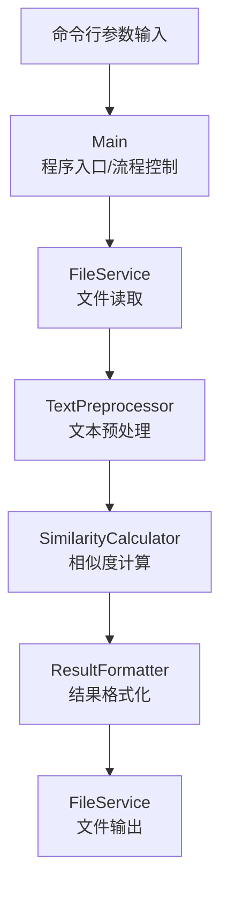
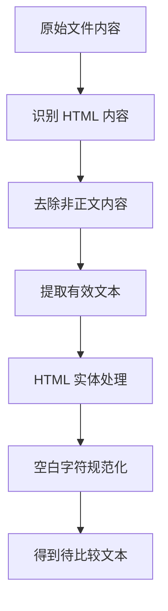
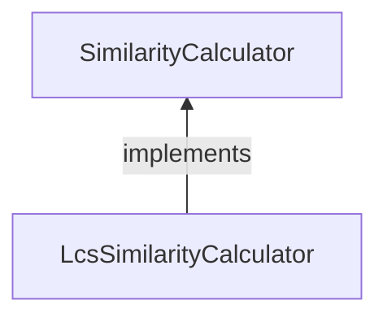
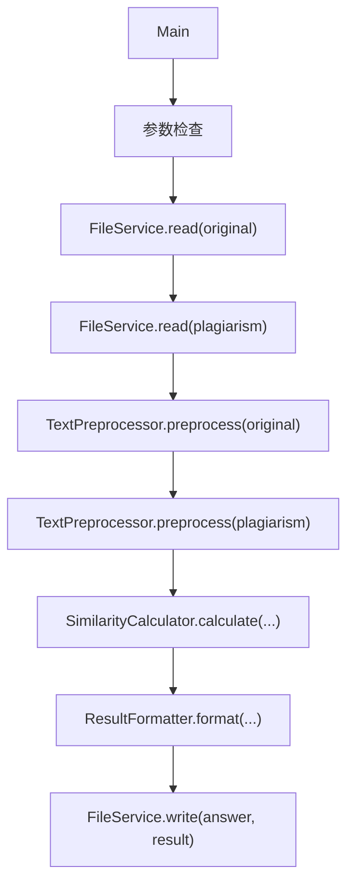
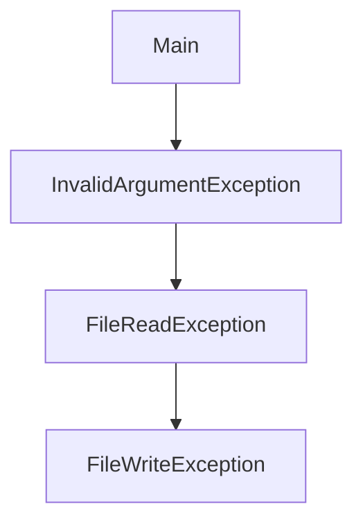
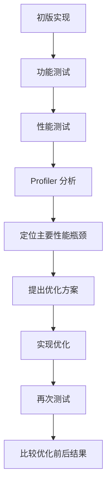
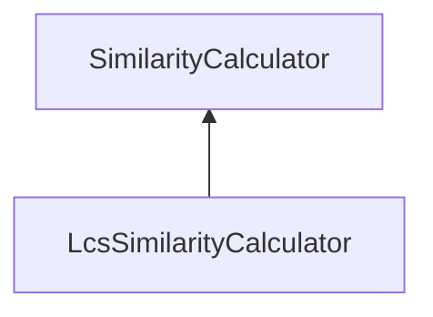
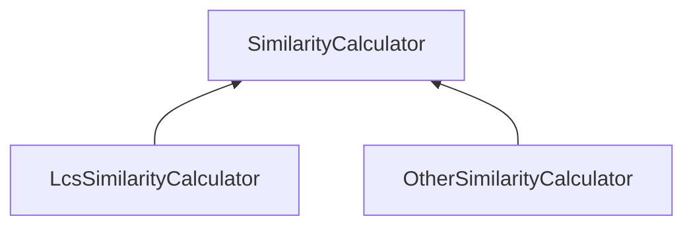
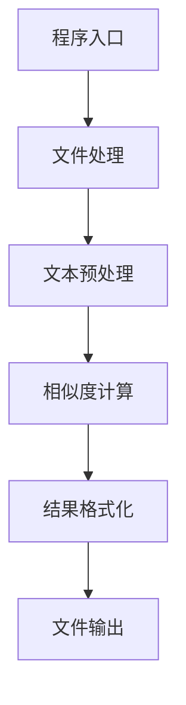

### 论文查重项目设计文档

#### 1. 文档概述

##### 1.1 项目名称

论文查重

##### 1.2 文档目的

本文档用于说明论文查重程序的整体设计方案，为后续具体编码、代码复审、单元测试以及性能优化提供依据。

设计方案根据项目需求、题目给出的输入输出规范、测试样例以及项目工程要求制定。

##### 1.3 设计原则

本项目遵循以下设计原则：

1. **模块化**：将文件处理、文本预处理、相似度计算、结果格式化等功能分离。
2. **高内聚、低耦合**：各模块只负责自身职责，通过明确的接口进行交互。
3. **可测试性**：核心功能应能够脱离程序入口独立测试。
4. **可扩展性**：相似度计算算法通过接口抽象，便于后续替换或优化算法。
5. **可维护性**：保持清晰的类结构、方法职责和命名规范。
6. **性能可优化**：初版实现完成后通过性能分析工具定位瓶颈，并针对性优化。

#### 2. 系统总体设计

##### 2.1 系统功能概述

程序接收三个命令行参数：

```
java -jar main.jar [original file] [plagiarism file] [answer file]
```

其中：

- `original file`：原始论文文件；
- `plagiarism file`：疑似抄袭论文文件；
- `answer file`：重复率计算结果的输出文件。

程序整体处理流程如下：



#### 3. 系统模块划分

系统主要划分为以下模块：

| 模块                      | 主要职责                             |
| ------------------------- | ------------------------------------ |
| `Main`                    | 程序入口、命令行参数处理、协调各模块 |
| `FileService`             | 文件读取和文件写入                   |
| `TextPreprocessor`        | HTML 内容处理和有效文本提取          |
| `SimilarityCalculator`    | 定义相似度计算接口                   |
| `LcsSimilarityCalculator` | 基于 `LCS` 的相似度计算初版实现      |
| `ResultFormatter`         | 对计算结果进行格式化                 |
| `exception`               | 定义和管理程序运行过程中的异常       |

模块之间通过接口和明确的数据进行交互，避免具体实现之间产生不必要的依赖。

#### 4. 模块详细设计

##### 4.1 Main 模块

###### 4.1.1 职责

`Main` 是程序入口，负责：

- 接收命令行参数；
- 检查参数数量和基本合法性；
- 调用文件读取模块；
- 调用文本预处理模块；
- 调用相似度计算模块；
- 调用结果格式化模块；
- 调用文件写入模块；
- 处理程序级异常。

###### 4.1.2 设计要求

`Main` 不直接实现：

- 文件读取细节；
- HTML 解析细节；
- `LCS` 算法；
- 结果计算逻辑。

其主要职责是组织程序执行流程。

#### 5. 文件处理模块设计

##### 5.1 `FileService`

文件操作统一由 `FileService` 负责。

接口设计：

```java
public interface FileService {
    String read(String path);
    void write(String path, String content);
}
```

###### 5.1.1 `read`

**功能**：根据指定路径读取文件内容。

**输入**：`文件路径`

**输出**：`文件完整内容`

可能产生的**异常**：

- 文件不存在；
- 文件无法读取；
- 文件编码或读取过程中发生异常。

###### 5.1.2 `write`

**功能**：将指定内容写入目标文件。

**输入**：

```
文件路径
输出内容
```

可能产生的**异常**：

- 目标目录不存在；
- 文件无法创建；
- 文件无法写入；
- 权限不足等。

#### 6. 文本预处理模块设计

##### 6.1 设计目的

目前提供的测试文件中包含 `GitHub` 页面相关的 HTML 内容，而实际参与重复率计算的目标应是其中的论文文本，因此不能直接对完整 HTML 源码进行相似度计算。

如果直接比较完整 HTML，`GitHub` 页面自身包含的大量相同 HTML、`CSS`、JavaScript 和页面结构内容可能被误认为论文内容，从而导致重复率计算失真。

因此，在相似度计算之前需要进行文本预处理。

##### 6.2 `TextPreprocessor`

定义接口：

```java
public interface TextPreprocessor {
    String preprocess(String text);
}
```

**输入**：`原始文件内容`

**输出**：`用于相似度计算的有效文本`

##### 6.3 文本预处理流程

初步设计如下：



具体包括：

###### 6.3.1 去除非正文内容

对于 HTML 中的`<script>`、`<style>`、页面结构信息等不属于论文正文的内容，应避免将其作为论文文本参与相似度计算。

###### 6.3.2 提取有效文本

从 HTML 内容中提取实际论文文本。

对于当前测试数据，应重点关注 `GitHub` 页面中保存的论文文本区域，而不能简单地把整个 HTML 页面作为论文正文。

###### 6.3.3 HTML 实体处理

对可能存在的 HTML 特殊字符或实体进行解码，使得到的文本恢复为正常字符。

###### 6.3.4 空白字符规范化

对连续空格、换行等进行统一处理，避免 HTML 页面格式差异对计算结果产生不必要影响。

具体是否删除某类字符，应结合测试样例进一步验证。

#### 7. 相似度计算模块设计

##### 7.1 接口抽象

相似度计算采用接口进行抽象：

```java
public interface SimilarityCalculator {
    double calculate(String original, String plagiarism);
}
```

其中：

- `original`：经过预处理的原始论文文本；
- `plagiarism`：经过预处理的疑似抄袭论文文本；
- 返回值：计算得到的相似度。

##### 7.2 采用接口抽象的原因

当前测试样例表明，文本可能存在：

- 字符增加；
- 字符删除；
- 字符顺序调整；
- 多种修改方式组合。

因此需要选择能够适应这些情况的相似度计算方法。

同时，题目目前尚未明确给出完整的数学计算公式，因此将算法实现与程序其他部分解耦，可以降低后续调整算法的成本。

例如：



如果后续通过标准测试结果会发现需要调整相似度计算方法，只需要替换 `SimilarityCalculator` 的具体实现，而无需修改文件处理和程序入口等模块。

#### 8. `LCS` 算法初步设计

##### 8.1 算法选择依据

根据目前测试样例的观察：

###### `add`：

疑似抄袭文本中增加了部分字符，但原文本中的大量字符仍保持原有相对顺序。

###### `del`：

疑似抄袭文本删除了原文中的部分字符，但剩余字符仍具有较强的原有顺序关系。

###### `dis`：

部分字符顺序发生重新排列。例如 `dis_10` 和 `dis_15` 中可以观察到较明显的字符重排。

因此，普通的连续子串匹配无法充分处理这些情况，而最长公共子序列（Longest Common Subsequence，`LCS`）可以在允许字符间存在插入、删除的情况下寻找两段文本的公共字符序列。

因此，**`LCS`** 作为第一版相似度计算算法的候选方案。

##### 8.2 LCS 定义

**设**：

```
原始文本：
S = s1, s2, ..., sn
疑似抄袭文本：
T = t1, t2, ..., tm
```

**定义**：`dp[i][j]`

表示原始文本前 `i` 个字符与疑似抄袭文本前 `j` 个字符的最长公共子序列长度。

**状态转移**：

当`S[i] == T[j]`时：

```java
dp[i][j] = dp[i-1][j-1] + 1
```

当`S[i] != T[j]`时：

```java
dp[i][j] = max(dp[i-1][j], dp[i][j-1])
```

最终：

```java
L = dp[n][m]
```

其中 `L` 为两段文本的 LCS 长度。

#### 9. 重复率计算公式

目前可根据测试样例特征提出以下候选方案：

```
Similarity = L / N
```

其中：

- `L`：两段有效文本的 `LCS` 长度；
- `N`：原始论文有效文本长度。

程序输出`Similarity`，并保留两位小数。

##### 9.1 当前方案的状态

需要特别说明：

> 上述公式目前属于根据测试样例提出的候选计算方案，而不是已经确认的题目标准公式。

原因是当前题目材料尚未明确给出完整的重复率数学定义。

尤其是 `dis_10`、`dis_15` 等样例显示，当字符顺序发生较大程度变化时，LCS 对文本相似程度的评价可能明显降低。

因此，在正式确定最终算法之前，需要：

1. 推导标准结果；
2. 使用不同候选算法进行计算；
3. 确认能够通过测试点的算法。

如果后续验证表明 LCS 不是最终方案，则只需要替换 `SimilarityCalculator` 的具体实现。

#### 10. LCS 初版实现的复杂度设计

##### 10.1 时间复杂度

传统二维动态规划：`O(N × M)`

其中：

- `N`：原始论文文本长度；
- `M`：疑似抄袭论文文本长度。

##### 10.2 空间复杂度

直接保存完整 DP 表：`O(N × M)`

当输入文本较长时，可能产生较大的内存开销。

因此，初版可以采用二维 DP 实现，以保证算法逻辑清晰、便于测试和性能分析。

后续根据实际 Profiling 结果考虑：

- 使用滚动数组降低空间复杂度；
- 优先使用较短文本作为 DP 的列方向；
- 去除两端相同前后缀；
- 根据实际性能瓶颈进一步优化。

#### 11. 结果格式化模块设计

##### 11.1 ResultFormatter

**定义**：

```java
public interface ResultFormatter {
    String format(double similarity);
}
```

**功能**：将计算得到的浮点数转换为符合题目要求的输出字符串。

例如：

```
0.8
```

格式化为：

```
0.80
```

格式化模块与相似度计算模块分离，使算法只负责计算数值，而不负责输出格式。

#### 12. 异常处理设计

##### 12.1 异常类型

根据功能划分，可以定义：

```
exception/
├── InvalidArgumentException
├── FileReadException
└── FileWriteException
```

###### `InvalidArgumentException`

用于：

- 命令行参数数量错误；
- 参数格式不符合要求。

###### `FileReadException`

用于：

- 文件不存在；
- 文件无法读取；
- 文件读取过程中发生异常。

###### `FileWriteException`

用于：

- 输出目录不存在；
- 输出文件无法创建；
- 输出文件无法写入。

##### 12.2 空文本处理

相似度计算中存在：

```
Similarity = L / N
```

因此当原始文本为空时可能发生除零问题。

程序需要在算法设计阶段明确空文本的处理规则，并在单元测试中覆盖以下三种情况：

```
原文为空
抄袭文非空

原文非空
抄袭文为空

两者均为空
```

具体返回值需要结合题目标准测试结果最终确定。

#### 13. 程序总体调用流程

程序正常运行时，调用关系设计为：



异常情况下：



由程序入口统一进行适当处理。

#### 14. 测试设计

##### 14.1 测试目标

测试不仅验证最终程序是否能够正常运行，还需要验证各模块的正确性。

重点测试：

1. 文件读取；
2. HTML 文本预处理；
3. 相似度计算；
4. 结果格式化；
5. 异常处理；
6. 边界情况。

##### 14.2 相似度计算测试

计划至少覆盖：

| 编号 | 测试场景         |
| ---- | ---------------- |
| 1    | 两段文本完全相同 |
| 2    | 两段文本完全不同 |
| 3    | 原文为空         |
| 4    | 抄袭文为空       |
| 5    | 两段文本均为空   |
| 6    | 增加字符         |
| 7    | 删除字符         |
| 8    | 修改一个字符     |
| 9    | 大量增加字符     |
| 10   | 大量删除字符     |
| 11   | 字符顺序调整     |
| 12   | 中文文本         |
| 13   | 英文文本         |
| 14   | 中英文混合       |
| 15   | 含标点符号       |
| 16   | 含 HTML 标签     |
| 17   | 含 HTML 实体     |
| 18   | 含连续空白字符   |
| 19   | 较长文本         |
| 20   | 特殊边界情况     |

最终测试用例数量不少于题目要求的 10 个，并通过覆盖率工具检查分支覆盖情况。

#### 15. 性能设计

##### 15.1 性能约束

根据题目要求：

- 单个测试点运行时间不超过 5 秒；
- 内存使用不超过 2048 MB；
- 不得出现严重内存泄漏或影响运行的异常。

##### 15.2 初版性能方案

初版优先实现逻辑清晰、容易验证的 LCS 动态规划算法。

初版复杂度：

```
时间复杂度：O(NM)
空间复杂度：O(NM)
```

完成初版后再使用 Profiling Tools 分析实际运行情况。

##### 15.3 性能分析流程

设计如下：



优化不以“提前猜测”为依据，而以实际 Profiling 数据为依据。

##### 15.4 可能的优化方向

如果 Profiling 表明 LCS 动态规划占用主要时间或内存，可以考虑：

###### 优化一：滚动数组

完整 DP：`O(NM) 空间`

优化为：`O(min(N,M)) 空间`

###### 优化二：缩短 DP 维度

让较短的字符串作为 DP 的空间维度，从而减少内存占用。

###### 优化三：去除公共前后缀

在进入 DP 前，可以先处理两段文本的公共前缀和公共后缀，减少实际参与动态规划的数据规模。

###### 优化四：根据 Profiling 结果进行进一步优化

具体优化方案不在设计阶段预先确定，而根据实际测试结果决定。

##### 16. 可测试性设计

为了方便单元测试，各核心模块应尽量独立。

例如：

```java
LcsSimilarityCalculator calculator = new LcsSimilarityCalculator();

double result = calculator.calculate("abcdef", "abcxef");
```

这样可以直接测试算法，而无需：启动完整程序/创建命令行参数/读取真实文件。

同样，`TextPreprocessor` 可以直接输入 HTML 字符串进行测试。

这种设计能够降低测试成本，并方便定位问题。

##### 17. 可扩展性设计

相似度计算通过接口`SimilarityCalculator`进行抽象。

初版：



如果经过测试发现其他算法更符合题目要求，会扩展为：



程序其他模块不需要直接依赖具体算法。

##### 18. 建议的项目结构

根据以上设计，项目目录初步规划如下：

```
项目根目录/
├── docs/
│   ├── requirements.md
│   ├── design-spec.md
│   └── coding-standard.md
│
├── src/
│   ├── main/
│   │   └── java/
│   │       └── com/
│   │           └── xxx/
│   │               └── plagiarism/
│   │                   ├── Main.java
│   │                   │
│   │                   ├── io/
│   │                   │   └── FileService.java
│   │                   │
│   │                   ├── preprocess/
│   │                   │   └── TextPreprocessor.java
│   │                   │
│   │                   ├── similarity/
│   │                   │   ├── SimilarityCalculator.java
│   │                   │   └── LcsSimilarityCalculator.java
│   │                   │
│   │                   ├── format/
│   │                   │   └── ResultFormatter.java
│   │                   │
│   │                   └── exception/
│   │                       ├── InvalidArgumentException.java
│   │                       ├── FileReadException.java
│   │                       └── FileWriteException.java
│   │
│   └── test/
│       └── java/
│
├── pom.xml
├── README.md
└── .gitignore
```

实际包名后续会根据个人项目进行调整。

##### 19. Git 开发规划

设计完成后，后续开发过程中按照功能逐步提交。

预计提交节点：

```
docs: add project requirements and PSP estimate

build: initialize Java Maven project

feat: implement command line argument parsing

feat: implement file reading and writing

feat: implement HTML text preprocessing

feat: implement LCS similarity calculation

test: add similarity calculator unit tests

test: add file service and exception tests

refactor: improve similarity module design

perf: optimize LCS memory usage

test: improve branch coverage

quality: fix code analysis warnings

build: package executable main.jar

docs: complete project documentation
```

具体提交信息可以根据实际开发过程调整。

##### 20. 设计阶段待验证问题

当前设计中仍存在一些需要在编码前进一步验证的问题：

1. 题目规定的重复率具体数学公式；
2. 各测试样例对应的标准输出；
3. `dis_10`、`dis_15` 等字符严重重排样例的标准评分方式；
4. HTML 页面中准确的正文提取范围；
5. 空白字符是否参与重复率计算；
6. 标点符号是否参与重复率计算；
7. 空文件的标准结果；
8. 输入文件的编码处理方式。

上述问题会在设计复审及正式编码前通过题目材料、测试样例和实验结果进一步确认。

##### 21. 设计结论

本项目采用分层、模块化设计，将程序划分为：



核心相似度计算采用接口抽象，第一版以字符级 LCS 作为候选实现，以便针对 `add`、`del` 和字符重排等测试类型进行验证。

初版优先保证功能正确性和代码可测试性，在完成测试后使用 Profiling Tools 分析实际性能，并根据性能瓶颈进行针对性优化。

最终算法及部分文本预处理细节以测试样例验证结果为准。