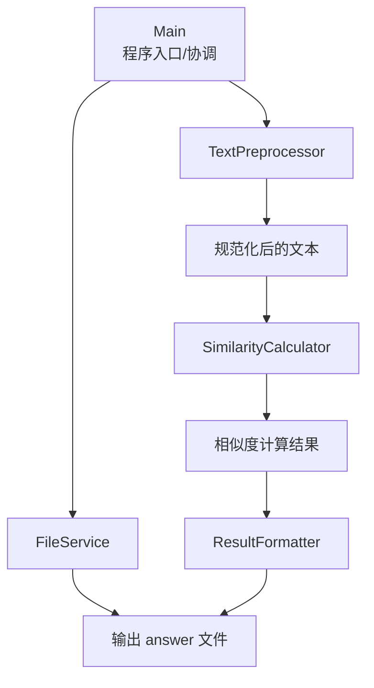
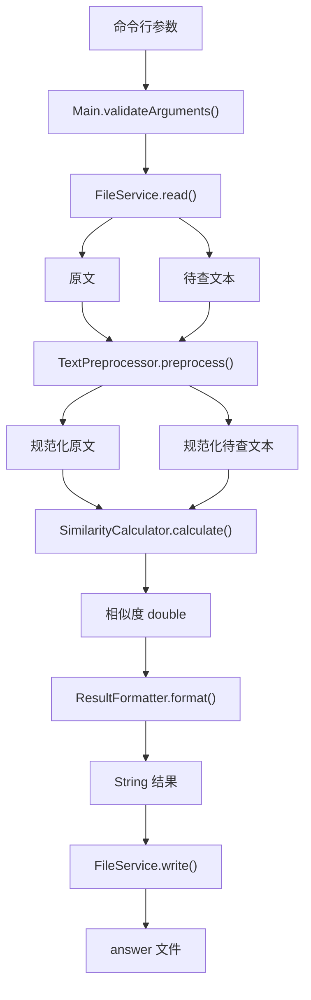
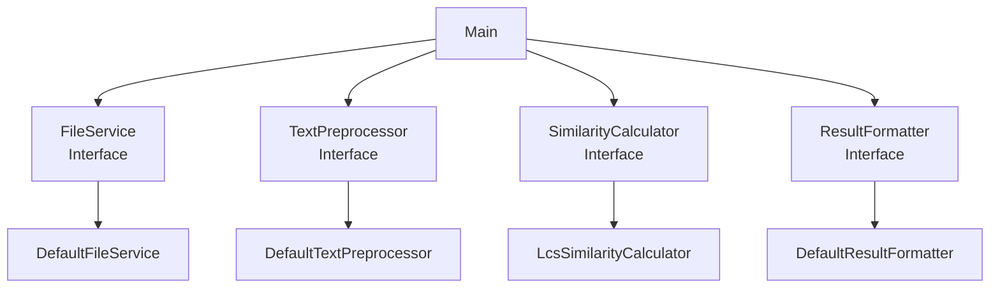
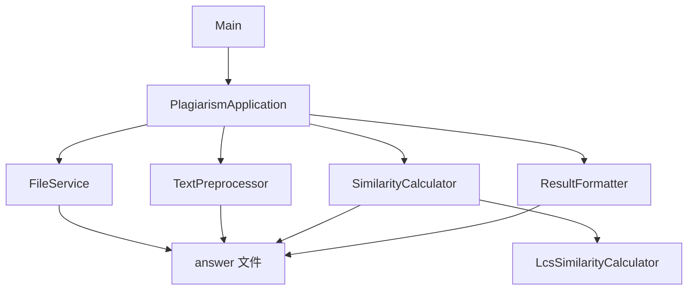

### Java 论文查重项目具体设计

#### 1. 文档说明

##### 1.1 编写目的

本文档是在前面文档的基础上，对论文查重项目进行进一步的详细设计。

本阶段的目标是明确：

- 每个模块具体由哪些类实现；
- 各类的职责；
- 接口、方法、参数和返回值；
- 类之间的依赖关系；
- 程序完整调用流程；
- 文本预处理流程；
- 相似度计算流程；
- 异常处理流程；
- 单元测试对应关系；
- 性能优化预留方案。

详细设计完成后，应能够直接进入编码阶段，而无需在编码过程中重新决定主要的软件结构。

#### 2. 设计原则

本项目详细设计遵循以下原则：

1. **单一职责**：一个类只负责一个明确功能。
2. **模块解耦**：文件处理、文本处理、算法计算和结果输出相互独立。
3. **接口隔离**：核心功能通过接口定义，具体算法通过实现类提供。
4. **可测试性**：核心逻辑可以脱离命令行和文件系统独立测试。
5. **可扩展性**：后续可以替换相似度算法，而不需要大规模修改其他模块。
6. **异常可控**：输入错误、文件错误等情况应被明确处理。
7. **先正确、后优化**：第一版优先保证正确性和可读性，再根据 Profiler 结果优化。
8. **样例驱动验证**：算法和预处理规则必须通过题目样例验证。

#### 3. 系统总体结构

##### 3.1 系统模块

系统划分为以下模块：



##### 3.2 模块列表

| 模块       | 主要类/接口                   | 主要职责                |
| ---------- | ----------------------------- | ----------------------- |
| 程序入口   | `Main`                        | 参数解析、模块协调      |
| 文件处理   | `FileService`                 | 文件读取和写入          |
| 文本预处理 | `TextPreprocessor`            | 文本清洗和规范化        |
| 相似度计算 | `SimilarityCalculator`        | 定义相似度计算接口      |
| 相似度实现 | `LcsSimilarityCalculator`     | 第一版候选 LCS 算法实现 |
| 结果处理   | `ResultFormatter`             | 输出结果格式化          |
| 异常处理   | `InvalidArgumentException` 等 | 统一处理异常            |

#### 4. 包结构详细设计

```
src/main/java/com/xxx/plagiarism/

├── Main.java
│
├── io/
│   └── FileService.java
│   └── DefaultFileService.java
│
├── preprocess/
│   └── TextPreprocessor.java
│   └── DefaultTextPreprocessor.java
│
├── similarity/
│   ├── SimilarityCalculator.java
│   └── LcsSimilarityCalculator.java
│
├── format/
│   ├── ResultFormatter.java
│   └── DefaultResultFormatter.java
│
└── exception/
    ├── InvalidArgumentException.java
    ├── FileReadException.java
    └── FileWriteException.java
```

测试代码：

```
src/test/java/com/xxx/plagiarism/

├── io/
├── preprocess/
├── similarity/
├── format/
└── MainTest.java
```

#### 5. `Main` 详细设计

##### 5.1 类职责

`Main` 是整个程序的入口。

主要负责：

1. 接收命令行参数；
2. 验证参数；
3. 创建或获取各个模块；
4. 读取原文和待查文本；
5. 调用文本预处理；
6. 调用相似度计算；
7. 调用结果格式化；
8. 将结果写入指定文件；
9. 对运行过程中的异常进行统一处理。

`Main` 不负责具体的算法实现。

##### 5.2 方法设计

###### `main`

```java
public static void main(String[] args)
```

**输入**：

命令行参数：

```java
args[0] = 原文路径
args[1] = 待查文本路径
args[2] = 答案文件路径
```

对应命令：

```
java -jar main.jar [original file] [plagiarism file] [answer file]
```

**输出**：无返回值。

最终结果写入`args[2]`

###### `validateArguments`

```java
private static void validateArguments(String[] args)
```

**职责**：

- 判断参数是否为空；
- 判断参数数量是否正确；
- 必须提供三个参数。

**异常**：

```
InvalidArgumentException
```

#### 6. 文件处理模块

##### 6.1 `FileService`

职责：定义文件读取和写入操作。

```java
public interface FileService {
    String read(String path);
    void write(String path, String content);
}
```

##### 6.2 `DefaultFileService`

实现：

```java
public class DefaultFileService
        implements FileService {
}
```

###### `read`

```java
public String read(String path)
```

**功能**：

1. 检查路径；
2. 创建 `Path`；
3. 使用 UTF-8 读取文件；
4. 返回文件内容；
5. 捕获 I/O 异常；
6. 转换为 `FileReadException`。

**实现思路**：

```java
Path filePath = Path.of(path);

try {
    return Files.readString(
            filePath,
            StandardCharsets.UTF_8
    );
} catch (IOException e) {
    throw new FileReadException(
            "Failed to read file: " + path,
            e
    );
}
```

###### `write`

```java
public void write(String path, String content)
```

**功能**：

1. 检查输出路径；
2. 使用 UTF-8 写入文件；
3. 写入最终格式化后的结果；
4. 捕获 I/O 异常；
5. 转换为 `FileWriteException`。

#### 7. 文本预处理模块

##### 7.1 设计目标

文本预处理模块负责将输入文件中的原始内容转换为可以进行相似度计算的文本。

**输入**：`原始文件内容`

**输出**：`规范化后的文本`

##### 7.2 `TextPreprocessor`

接口：

```java
public interface TextPreprocessor {
    String preprocess(String text);
}
```

##### 7.3 `DefaultTextPreprocessor`

实现：

```java
public class DefaultTextPreprocessor
        implements TextPreprocessor {
}
```

主要处理流程：

```
原始文本
   ↓
判断是否需要 HTML 处理
   ↓
HTML 内容提取/标签处理
   ↓
HTML entity 处理
   ↓
空白字符处理
   ↓
按照最终确认的规则进行规范化
   ↓
返回处理后的文本
```

##### 7.4 HTML 处理

样例中存在 HTML 类文本，因此预处理模块必须考虑 HTML。

但具体处理规则仍需要通过样例验证。

###### 当前设计原则

如果输入为：

```html
<html>
<body>
<p>This is a paper.</p>
</body>
</html>
```

最终参与相似度计算的应主要是：

```
This is a paper.
```

而不是：

```html
<html>
<body>
<p>
...
```

##### 7.5 HTML 标签处理

第一版实现应避免使用过于简单的正则表达式处理所有 HTML，故此处不直接依赖：

```java
text.replaceAll("<.*?>", "");
```

而是根据样例实际格式决定实现方式，因为真实 HTML 可能存在：

- 属性；
- 换行；
- 嵌套标签；
- `<script>`；
- `<style>`；
- HTML entity。

##### 7.6 HTML entity

需要考虑：

```html
&nbsp;
&amp;
&lt;
&gt;
&quot;
```

等 HTML entity。

例如：

```html
A &amp; B
```

应根据预处理规则转换为：

```
A & B
```

具体需要处理的 entity 范围以样例验证结果为准。

##### 7.7 空白字符处理

当前设计不直接规定删除所有空白字符。

需要通过样例确认：

```
Hello World
```

和：

```
Hello    World
```

是否应该被视为相同内容。

因此可以将空白处理封装为独立方法：

```java
private String normalizeWhitespace(String text)
```

后续若修改规则，只需要修改预处理模块。

##### 7.8 大小写处理

暂不默认转换大小写。

即不直接执行：

```java
text.toLowerCase()
```

除非最终需求分析和样例验证确认大小写不参与相似度判断。

##### 7.9 标点处理

暂不默认删除标点。

例如：

```
Hello, world!
```

中的“,”和“!”是否参与计算，需要根据最终规则确定。

#### 8. 相似度计算模块

##### 8.1 `SimilarityCalculator`

定义统一的相似度计算接口：

```java
public interface SimilarityCalculator {
    double calculate(
            String originalText,
            String plagiarismText
    );
}
```

设计目的：

```
Main
 ↓
SimilarityCalculator
 ↓
具体算法
```

而不是：

```
Main
 ↓
LcsSimilarityCalculator
```

这样可以降低模块耦合。

#### 9. `LcsSimilarityCalculator` 详细设计

##### 9.1 类职责

第一版使用 LCS（Longest Common Subsequence，最长公共子序列）作为候选相似度计算算法。

注意：

> LCS 是当前设计阶段的第一版候选实现，并非已经确认的题目官方算法。

最终是否采用该算法，需要通过全部已知样例及标准结果进一步验证。

#### 10. LCS 算法设计

设：

```
A = 原文
B = 待查文本
```

长度分别为：

```java
N = A.length()
M = B.length()
```

定义：

```java
dp[i][j]
```

表示A 的前 i 个字符和B 的前 j 个字符的最长公共子序列长度。

##### 10.1 初始条件

当任意一个字符串为空：

```java
dp[0][j] = 0
dp[i][0] = 0
```

##### 10.2 状态转移

如果`A[i - 1] == B[j - 1]`

则：

```java
dp[i][j] = dp[i - 1][j - 1] + 1
```

否则：

```java
dp[i][j]
    = max(
        dp[i - 1][j],
        dp[i][j - 1]
      )
```

最终：

```java
L = dp[N][M]
```

#### 11. 候选相似度公式

当前设计阶段考虑：

```
similarity = L / N
```

其中：

```
L = LCS 长度
N = 原文预处理后的长度
```

最终输出`similarity`并保留两位小数。

##### 11.1 重要说明

当前公式**尚未最终确认**。

原因是样例中存在：

```
add
del
dis_1
dis_10
dis_15
```

等不同修改类型，其中部分样例涉及内容增加、删除、修改以及顺序变化，需要验证简单 LCS 是否能够得到题目要求的结果。

因此，详细设计阶段只确定`SimilarityCalculator`接口，而将具体计算规则保留在`LcsSimilarityCalculator`内部，如果后续验证发现 LCS 不符合标准结果，可以替换算法实现，而不修改其他模块。

#### 12. LCS 第一版伪代码

```
function calculate(original, plagiarism):

    if original is null:
        throw exception

    if plagiarism is null:
        throw exception

    n = length(original)
    m = length(plagiarism)

    if n == 0:
        handle according to empty-input rule

    create dp[n + 1][m + 1]

    for i from 1 to n:
        for j from 1 to m:

            if original[i - 1] == plagiarism[j - 1]:
                dp[i][j] =
                    dp[i - 1][j - 1] + 1

            else:
                dp[i][j] =
                    max(
                        dp[i - 1][j],
                        dp[i][j - 1]
                    )

    lcsLength = dp[n][m]

    similarity =
        calculateSimilarity(
            lcsLength,
            n
        )

    return similarity
```

#### 13. LCS 空间优化预留

二维 DP：

```
dp[n + 1][m + 1]
```

空间复杂度为`O(N × M)`

但计算`dp[i][j]`时，实际上只依赖上一行和当前行，因此后续可以优化为滚动数组。

例如：

```
previous[j]
current[j]
```

空间复杂度降低为`O(M)`，进一步可以根据较短字符串选择数组长度`O(min(N, M))`，但第一版是否采用空间优化，应根据<u>代码复杂度、输入规模、实际内存占用、Profiler 数据</u>决定。

#### 14. 结果格式化模块

##### 14.1 `ResultFormatter`

接口：

```java
public interface ResultFormatter {
    String format(double similarity);
}
```

##### 14.2 `DefaultResultFormatter`

职责：将计算得到的浮点数转换为最终输出字符串。

例如：

```
0.8333333
```

转换为：

```
0.83
```

##### 14.3 格式化规则

建议使用：

```java
String.format(
        Locale.ROOT,
        "%.2f",
        similarity
);
```

使用 `Locale.ROOT` 的目的是避免程序在不同系统 Locale 下产生不同的小数格式。

例如避免某些 Locale 使用：

```
0,83
```

而题目要求：

```
0.83
```

#### 15. 异常类详细设计

##### 15.1 `InvalidArgumentException`

用于处理命令行参数错误。

例如：

```
参数数量不正确
参数为空
```

##### 15.2 `FileReadException`

用于处理：

```
文件不存在
文件无法读取
文件编码读取失败
I/O 异常
```

##### 15.3 `FileWriteException`

用于处理：

```
输出路径无效
没有写入权限
输出文件无法创建
I/O 异常
```

#### 16. 异常传播流程

异常传播关系：

```
Files.readString()
       ↓
IOException
       ↓
FileService
       ↓
FileReadException
       ↓
Main
       ↓
统一处理
```

类似地：

```
Files.writeString()
       ↓
IOException
       ↓
FileService
       ↓
FileWriteException
       ↓
Main
```

底层异常不得被无意义地吞掉。

#### 17. 空输入设计

空文本属于重要边界情况。

需要考虑：

##### 情况一

```java
original = ""
plagiarism = "abc"
```

##### 情况二

```java
original = "abc"
plagiarism = ""
```

##### 情况三

```java
original = ""
plagiarism = ""
```

当前详细设计只规定：

> 程序不得出现除零、数组越界或异常崩溃。

具体返回值应根据题目最终规则确定，并在需求分析/设计复审阶段记录。

#### 18. 完整数据流

程序运行过程如下：



#### 19. 类之间的关系



#### 20. Main 调用流程

最终实现暂定为：

```
main(args)
    │
    ├── validateArguments(args)
    │
    ├── create FileService
    ├── create TextPreprocessor
    ├── create SimilarityCalculator
    ├── create ResultFormatter
    │
    ├── original =
    │      fileService.read(args[0])
    │
    ├── plagiarism =
    │      fileService.read(args[1])
    │
    ├── processedOriginal =
    │      preprocessor.preprocess(original)
    │
    ├── processedPlagiarism =
    │      preprocessor.preprocess(plagiarism)
    │
    ├── similarity =
    │      calculator.calculate(
    │          processedOriginal,
    │          processedPlagiarism
    │      )
    │
    ├── result =
    │      formatter.format(similarity)
    │
    └── fileService.write(
           args[2],
           result
        )
```

#### 21. 依赖注入方式

为了提高可测试性，`Main` 中的模块最好通过构造器传入。

例如：

```java
public class PlagiarismApplication {

    private final FileService fileService;
    private final TextPreprocessor preprocessor;
    private final SimilarityCalculator calculator;
    private final ResultFormatter formatter;

    public PlagiarismApplication(
            FileService fileService,
            TextPreprocessor preprocessor,
            SimilarityCalculator calculator,
            ResultFormatter formatter) {

        this.fileService = fileService;
        this.preprocessor = preprocessor;
        this.calculator = calculator;
        this.formatter = formatter;
    }
}
```

这样测试时可以替换成测试用实现。

#### 22. 推荐增加应用协调类

如果 `Main` 逐渐变得复杂，可以将真正的业务流程从 `Main` 中抽取出来。

增加：

```
PlagiarismApplication
```

职责：

```
参数已经验证
      ↓
读取文件
      ↓
预处理
      ↓
相似度计算
      ↓
格式化
      ↓
写入结果
```

此时Main只负责：

```
程序启动
+
创建对象
+
调用 Application
+
处理顶层异常
```

结构变为：

```
Main
 ↓
PlagiarismApplication
 ├── FileService
 ├── TextPreprocessor
 ├── SimilarityCalculator
 └── ResultFormatter
```

这种结构有利于单元测试。

#### 23. 测试设计对应关系

详细设计阶段需要保证每个模块都有独立测试。

##### 23.1 `FileService` 测试

测试：

```
正常读取文件
正常写入文件
文件不存在
路径非法
中文文件
空文件
```

##### 23.2 `TextPreprocessor` 测试

测试：

```
普通文本
HTML 文本
HTML 标签
HTML entity
换行
空白字符
中文
英文
中英文混合
空字符串
```

##### 23.3 `SimilarityCalculator` 测试

测试：

```
完全相同
完全不同
增加内容
删除内容
修改内容
顺序变化
混合变化
空文本
中文
英文
中英文混合
长文本
```

##### 23.4 `ResultFormatter` 测试

测试：

```
0
1
0.123456
0.995
0.005
```

验证最终均为两位小数。

#### 24. 测试用例规划

建议至少建立以下测试：

| 编号 | 测试场景       | 目标模块     |
| ---- | -------------- | ------------ |
| TC01 | 两文本完全相同 | Similarity   |
| TC02 | 两文本完全不同 | Similarity   |
| TC03 | 原文增加内容   | Similarity   |
| TC04 | 删除原文内容   | Similarity   |
| TC05 | 修改部分字符   | Similarity   |
| TC06 | 文本顺序变化   | Similarity   |
| TC07 | 多种修改混合   | Similarity   |
| TC08 | 中文文本       | Similarity   |
| TC09 | 英文文本       | Similarity   |
| TC10 | 中英文混合     | Similarity   |
| TC11 | 空原文         | Similarity   |
| TC12 | 空查重文本     | Similarity   |
| TC13 | 两个空文本     | Similarity   |
| TC14 | 普通 HTML      | Preprocessor |
| TC15 | HTML entity    | Preprocessor |
| TC16 | 多余空白       | Preprocessor |
| TC17 | 文件不存在     | FileService  |
| TC18 | 文件正常读取   | FileService  |
| TC19 | 正常写入结果   | FileService  |
| TC20 | 两位小数格式化 | Formatter    |

实际测试数量不少于作业要求的 10 个。

#### 25. 样例验证设计

程序开发后，需要建立样例验证流程。

对于每个题目提供的样例：

```
orig
add
del
dis_1
dis_10
dis_15
mix
rep
```

均进行程序运行验证。

验证过程：

```
样例文件
   ↓
程序执行
   ↓
生成 answer
   ↓
读取结果
   ↓
与标准结果比较
```

不能只验证`orig vs orig`就认为算法正确。

#### 26. 算法验证重点

重点验证：

##### 26.1 完全相同

理论上`原文 = 查重文本`应得到最高相似度。

##### 26.2 增加

验证`原文+新增内容`情况下结果是否符合标准。

##### 26.3 删除

验证删除部分文本后的结果。

##### 26.4 重排

重点验证dis_1、dis_10、dis_15等顺序变化样例。

如果 LCS 得到的结果与标准结果存在明显偏差，则需要重新评估算法。

#### 27. 性能设计

##### 27.1 第一版目标

第一版优先实现<u>正确、清晰、可测试</u>，暂不针对性能进行过度优化。

##### 27.2 性能风险

当前主要性能风险`LCS O(N × M)`，如果输入文本较长，`N × M`可能迅速增长。

###### 27.3 Profiling

第一版完成后执行 Profiler。

重点查看：

```java
LcsSimilarityCalculator.calculate()
```

是否成为 CPU Hotspot。

同时观察：

```
内存分配
二维数组占用
字符串对象数量
GC
```

#### 28. 性能优化方案

如果 Profiler 证明二维 DP 是主要瓶颈，可以按以下顺序考虑。

##### 优化一：降低 DP 空间

从：

```
O(N × M)
```

降低到：

```
O(min(N, M))
```

##### 优化二：减少重复字符串处理

确保预处理只执行一次。

不应出现：

```
calculate()
    ↓
每次循环重新 preprocess()
```

而应：

```
preprocess()
    ↓
calculate()
```

##### 优化三：减少临时对象

在热点循环中避免大量：

```
String
Character
包装对象
```

的创建。

##### 优化四：算法替换

如果样例和性能要求证明 LCS 无法满足要求，可以重新设计 `SimilarityCalculator` 的具体实现。

例如：

```
SimilarityCalculator
       ↑
       ├── LcsSimilarityCalculator
       └── OtherSimilarityCalculator
```

但具体算法必须根据测试结果和题目规则确定，不能为了性能随意替换。

#### 29. 内存设计

第一版二维 DP：

```
int[][] dp;
```

可能产生较大的内存开销。

需要避免：

```
创建多个相同大小的 DP 数组
```

如果采用滚动数组：

```
int[] previous;
int[] current;
```

可以显著降低空间占用。

#### 30. 编码实施顺序

详细设计完成后，不建议直接一次性编写所有代码。

推荐按照模块逐步实现：

```
Step 1
创建 Maven 项目
        ↓
Step 2
建立 package 结构
        ↓
Step 3
实现异常类
        ↓
Step 4
实现 FileService
        ↓
Step 5
为 FileService 编写测试
        ↓
Step 6
实现 TextPreprocessor
        ↓
Step 7
为 TextPreprocessor 编写测试
        ↓
Step 8
实现 SimilarityCalculator
        ↓
Step 9
实现 LCS 第一版
        ↓
Step 10
为 LCS 编写测试
        ↓
Step 11
实现 ResultFormatter
        ↓
Step 12
为 Formatter 编写测试
        ↓
Step 13
实现 Application / Main
        ↓
Step 14
执行全部单元测试
        ↓
Step 15
执行题目样例
        ↓
Step 16
修正算法/预处理规则
        ↓
Step 17
代码质量检查
        ↓
Step 18
Profiler 性能分析
        ↓
Step 19
性能优化
        ↓
Step 20
回归测试
```

#### 31. Git 提交节点

建议按照以下节点提交：

```
docs: add detailed design

feat: create project structure

feat: implement file service

test: add file service tests

feat: implement text preprocessor

test: add text preprocessor tests

feat: implement similarity calculator

feat: implement lcs algorithm

test: add similarity calculation tests

feat: implement result formatter

test: add formatter tests

feat: implement application entry

test: add integration tests

fix: correct preprocessing behavior

fix: correct similarity calculation

refactor: improve module structure

perf: optimize similarity calculation
```

每个阶段完成后及时提交，而不是所有代码完成后再一次性提交。

#### 32. 详细设计与需求的对应关系

| 需求           | 详细设计                  |
| -------------- | ------------------------- |
| 三个命令行参数 | `Main`                    |
| 读取原文       | `FileService.read()`      |
| 读取查重文本   | `FileService.read()`      |
| 文本预处理     | `TextPreprocessor`        |
| HTML 样例      | `DefaultTextPreprocessor` |
| 相似度计算     | `SimilarityCalculator`    |
| LCS 第一版     | `LcsSimilarityCalculator` |
| 两位小数       | `ResultFormatter`         |
| 输出答案文件   | `FileService.write()`     |
| 异常处理       | `exception`               |
| 单元测试       | `src/test/java`           |
| 至少 10 个测试 | 测试用例规划              |
| 性能分析       | Profiler                  |
| 性能优化       | LCS 空间优化等            |
| Git 管理       | Git 提交节点              |
| GitHub Release | `main.jar`                |

#### 33. 当前设计中的待确认事项

以下内容在进入最终版本前必须通过样例验证：

##### 33.1 相似度公式

当前候选：

```
similarity = LCS / originalLength
```

##### 33.2 HTML 处理范围

需要确认：

```
哪些标签需要删除
script/style 是否完全忽略
HTML entity 如何处理
HTML 空白如何处理
```

##### 33.3 空白字符规则

需要确认：

```
空格
换行
制表符
连续空白
```

是否参与相似度计算。

##### 33.4 标点符号规则

需要确认标点是否参与计算。

##### 33.5 大小写规则

需要确认英文大小写是否敏感。

##### 33.6 空文件规则

需要明确：

```java
original = ""
plagiarism = ""
```

以及：

```java
original = ""
plagiarism != ""
```

时的结果。

#### 34. 设计结论

本项目采用分层、模块化结构：



该设计能够满足当前需求，同时保留后续修改算法、优化性能和增加测试的空间。

第一版实现应以**正确性和可验证性为优先**。LCS 作为当前候选实现，应通过 `orig`、`add`、`del`、`dis_1`、`dis_10`、`dis_15`、`mix`、`rep` 等样例进行验证。

如果验证结果证明当前算法或预处理规则不满足要求，应优先修改具体实现，而不修改接口层和整体架构。

完成本详细设计后，项目即将正式进入 **Coding / 编码阶段**。