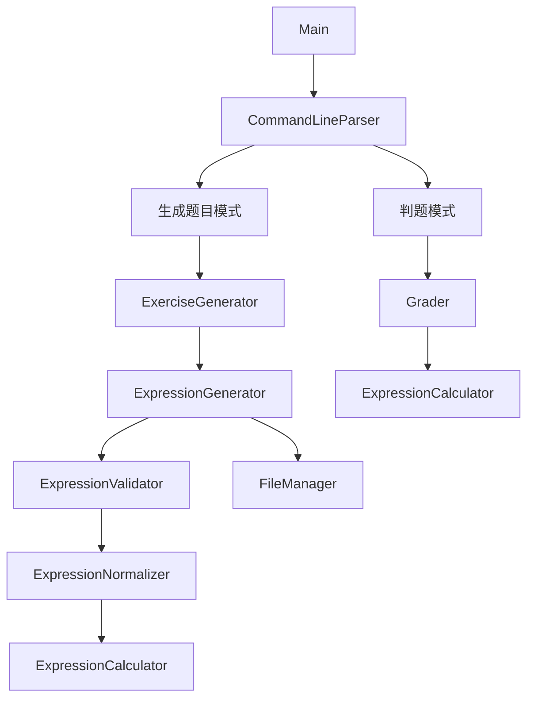
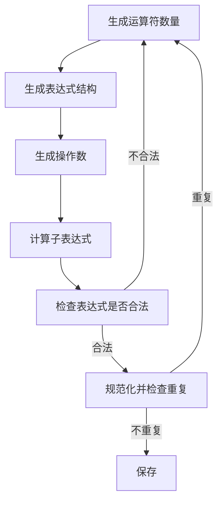
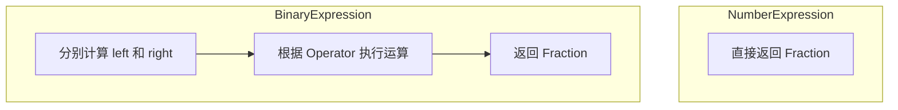
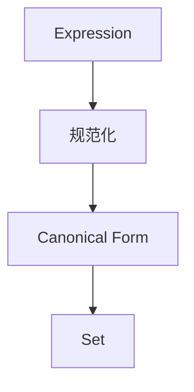

# 设计文档

## 1. 设计目标

本项目采用 **Java + Maven + CLI** 实现小学四则运算题目生成程序。

系统主要包括两个功能：

1. 根据命令行参数生成指定数量的四则运算题目。
2. 根据题目文件和答案文件进行自动判题并生成统计结果。

设计重点是保证题目生成的正确性、重复题判断的准确性以及大量题目生成时的性能。

## 2. 系统总体结构

程序按照功能划分为以下几个模块：



主要模块职责如下：

| 模块                   | 主要职责                             |
| ---------------------- | ------------------------------------ |
| `Main`                 | 程序入口，协调各模块                 |
| `CommandLineParser`    | 解析和检查命令行参数                 |
| `ExerciseGenerator`    | 控制题目数量并生成题目               |
| `ExpressionGenerator`  | 生成表达式结构和操作数               |
| `Expression`           | 表示算术表达式                       |
| `Fraction`             | 表示和计算自然数、分数               |
| `ExpressionCalculator` | 计算表达式结果                       |
| `ExpressionValidator`  | 检查减法、除法等是否合法             |
| `ExpressionNormalizer` | 将表达式转换为规范形式，用于判断重复 |
| `FileManager`          | 负责题目、答案和成绩文件的读写       |
| `Grader`               | 根据答案文件进行判题和统计           |

## 3. 核心数据设计

### 3.1 Fraction

使用 `Fraction` 表示程序中的数值。

统一使用：

```tex
numerator / denominator
```

表示分数，并保证：

- 分母不为 0；
- 分母保持为正数；
- 分数进行约分；
- 整数可以作为分母为 1 的分数处理。

例如：

```tex
2       → 2/1
4/8     → 1/2
2'3/4   → 11/4
```

这样可以统一处理自然数和分数运算。

### 3.2 Operator

使用枚举表示四种运算符：

```
ADD       +
SUBTRACT  -
MULTIPLY  ×
DIVIDE    ÷
```

由 `Operator` 统一保存运算符信息及相关属性。

### 3.3 Expression

采用**表达式树**表示算术表达式，而不是直接使用字符串保存。

基本结构：

```tex
Expression
├── NumberExpression
└── BinaryExpression
    ├── left
    ├── operator
    └── right
```

例如：

```tex
(3 + 5) × 2
```

表示为：

```tex
        ×
       / \
      +   2
     / \
    3   5
```

表达式树可以统一支持：

- 表达式计算；
- 表达式输出；
- 合法性检查；
- 重复题判断。

## 4. 题目生成设计

### 4.1 生成流程

题目生成采用随机生成方式：



每道题的运算符数量限制为 1～3 个。

### 4.2 合法性检查

生成表达式后，通过 `ExpressionValidator` 检查：

1. 减法是否产生负数；
2. 除数是否为 0；
3. 除法结果是否为真分数；
4. 运算符数量是否超过 3 个；
5. 表达式结构是否符合要求。

只有通过检查的表达式才能作为最终题目。

## 5. 表达式计算设计

`ExpressionCalculator` 负责计算表达式树。

计算过程采用递归方式：



所有计算统一转换为 `Fraction`，避免分别处理整数和分数带来的复杂性。

## 6. 重复题判断设计

由于题目要求考虑加法和乘法的交换律，以及特定情况下的结合关系，不能直接比较两个题目的字符串。

系统增加 `ExpressionNormalizer` 模块：



例如：

```tex
23 + 45
45 + 23
```

经过规范化后应得到相同的表示。

对于题目规定的结合关系，也需要在规范化过程中进行处理。

最终使用集合保存已经生成题目的规范形式：

```java
Set<String>
```

生成新题时：

```java
canonical = normalize(expression)

if canonical 已存在
    重新生成
else
    加入集合
```

具体的规范化规则将在详细设计阶段进一步确定。

## 7. 文件设计

### 7.1 Exercises.txt

生成题目保存为：

```tex
1. 题目1
2. 题目2
3. 题目3
...
```

### 7.2 Answer.txt

根据程序生成的文件Exercises.txt，保存对应的答案：

```tex
1. 答案1
2. 答案2
3. 答案3
...
```

### 7.3 StuTest.txt

答案文件按照题目顺序保存答案。

程序假定输入的题目和答案符合规定格式。

### 7.4 Grade.txt

判题结果保存为：

```tex
Correct: 5 (1, 3, 5, 7, 9)
Wrong: 5 (2, 4, 6, 8, 10)
```

## 8. 命令行设计

### 8.1 生成模式

```powershell
java -jar Arithmetic.jar -n 10 -r 10
```

参数：

```tex
-n 题目数量
-r 数值范围
```

其中 `-r` 为必须参数。

### 8.2 判题模式

```powershell
java -jar Arithmetic.jar -e Exercises.txt -a StuTest.txt
```

参数：

```tex
-e 题目文件
-a 答案文件
```

程序根据参数组合自动判断当前运行模式。

## 9. 异常处理

程序需要对常见异常进行处理，包括：

- 参数缺失；
- 参数格式错误；
- 数值范围非法；
- 文件不存在；
- 文件无法读取；
- 文件无法写入；
- 除数为 0；
- 非法表达式。

程序应向用户输出清晰的错误信息，而不是直接输出 Java 异常堆栈。

## 10. 性能设计

程序需要支持一次生成最多 10000 道题目。

重复题判断使用集合保存规范化后的表达式，避免逐题与所有历史题目进行比较。

性能分析阶段重点关注：

- 题目生成；
- 表达式计算；
- 表达式规范化；
- 重复题判断；
- 文件写入。

后续通过性能测试确定实际瓶颈，并针对瓶颈进行优化。

## 11. 可测试性设计

各核心模块尽量保持独立，以便进行单元测试。

重点测试：

- `Fraction`
- `ExpressionCalculator`
- `ExpressionValidator`
- `ExpressionNormalizer`
- `ExpressionGenerator`
- `CommandLineParser`
- `Grader`

测试应覆盖正常情况、边界情况和异常情况。

## 12. 设计原则

本项目遵循以下原则：

1. **单一职责**：每个模块负责相对独立的功能。
2. **模块化**：将参数处理、表达式处理、题目生成、文件处理和判题分离。
3. **数据统一**：自然数和分数统一使用 `Fraction` 表示。
4. **表达式结构化**：使用表达式树表示算术表达式。
5. **可测试性**：核心计算和判断逻辑与文件、命令行等外部操作解耦。
6. **可扩展性**：后续可以在不大幅修改核心计算模块的情况下增加新的功能。