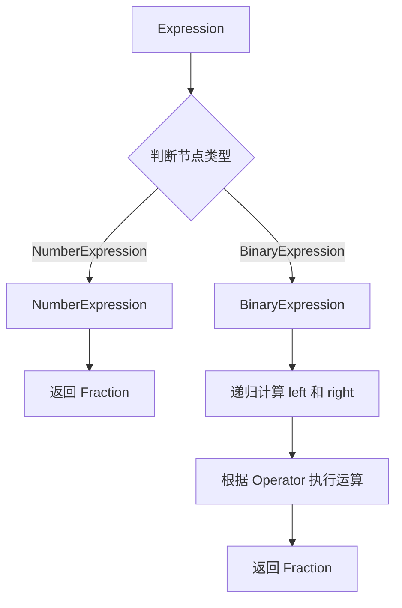
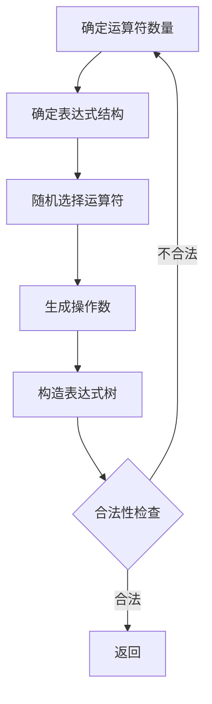
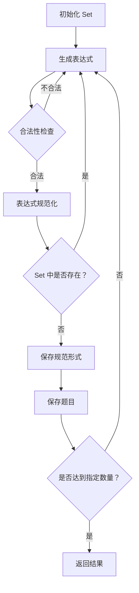
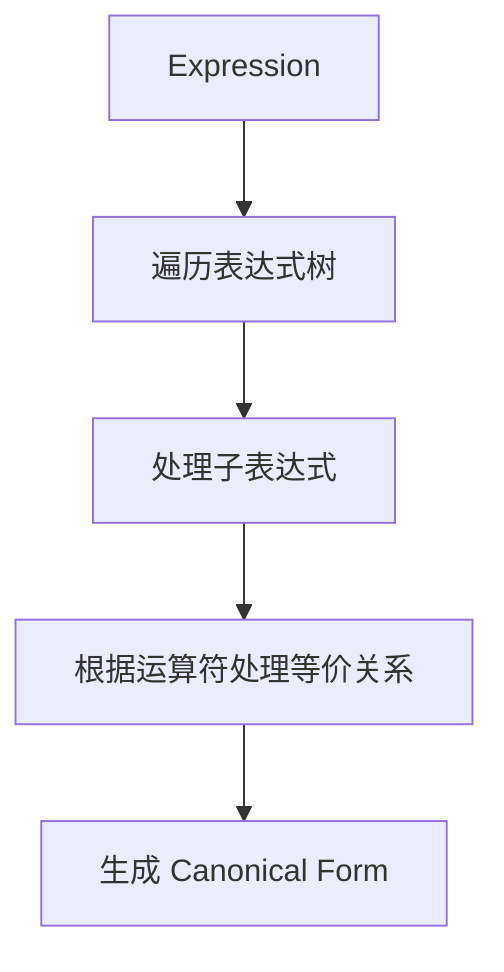
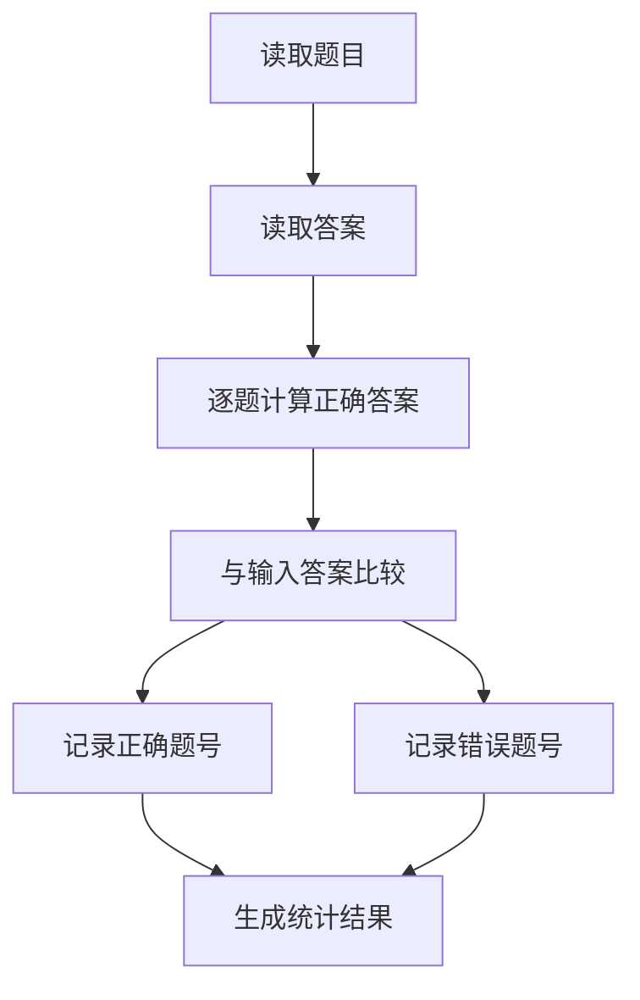
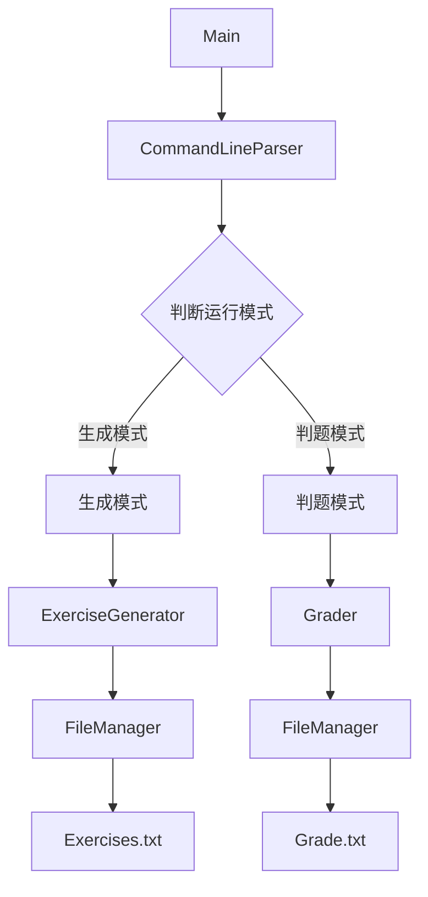

# 具体设计

## 1. 项目结构

项目采用 Maven 标准目录结构：

```tex
src/
├── main/
│   └── java/
│       └── com/Ajie8021/arithmetic/
│           ├── Main.java
│           ├── cli/
│           ├── model/
│           ├── calculator/
│           ├── generator/
│           ├── validator/
│           ├── normalizer/
│           ├── io/
│           └── grader/
│
└── test/
    └── java/
        └── com/Ajie8021/arithmetic/
```

各包职责如下：

| 包           | 职责                           |
| ------------ | ------------------------------ |
| `cli`        | 命令行参数解析                 |
| `model`      | 表达式、分数、运算符等数据模型 |
| `calculator` | 表达式计算                     |
| `generator`  | 题目和表达式生成               |
| `validator`  | 表达式合法性检查               |
| `normalizer` | 重复题规范化                   |
| `io`         | 文件输入输出                   |
| `grader`     | 答案判定和成绩统计             |

## 2. 核心数据模型

### 2.1 Fraction

`Fraction` 用于统一表示自然数、真分数和带分数。

主要属性：

```tex
numerator
denominator
```

主要方法：

```tex
add(Fraction)
subtract(Fraction)
multiply(Fraction)
divide(Fraction)
compareTo(Fraction)
isProperFraction()
toString()
```

设计要求：

- 分母不能为 0；
- 分母始终保持为正数；
- 创建对象时自动约分；
- 使用整数进行精确计算；
- 不使用 `float` 或 `double` 表示计算结果。

## 3. 运算符设计

定义：

```tex
Operator
├── ADD
├── SUBTRACT
├── MULTIPLY
└── DIVIDE
```

每个运算符至少保存：

- 显示符号；
- 运算优先级；
- 是否满足交换律。

例如：

```rex
ADD       +
SUBTRACT  -
MULTIPLY  ×
DIVIDE    ÷
```

## 4. 表达式模型

表达式采用树结构表示。

### 4.1 Expression

作为所有表达式节点的抽象父类型。

主要操作：

```tex
evaluate()
toString()
getOperatorCount()
```

### 4.2 NumberExpression

表示一个操作数。

```tex
NumberExpression
    └── Fraction value
```

例如：

```tex
3
1/2
2'3/4
```

统一转换为 `Fraction` 保存。

### 4.3 BinaryExpression

表示二元运算：

```tex
BinaryExpression
├── left: Expression
├── operator: Operator
└── right: Expression
```

例如：

```tex
(3 + 5) × 2
```

对应：

```tex
        ×
       / \
      +   2
     / \
    3   5
```

## 5. 表达式计算模块

### 5.1 ExpressionCalculator

负责计算表达式树的结果。

核心方法：

```tex
calculate(Expression)
```

处理流程：



计算模块不负责判断题目是否合法，合法性检查由 `ExpressionValidator` 完成。

## 6. 表达式合法性检查

### 6.1 ExpressionValidator

负责检查表达式是否符合题目要求。

核心方法：

```tex
isValid(Expression)
validateSubtraction(Expression)
validateDivision(Expression)
validateOperatorCount(Expression)
```

主要检查：

1. 运算符数量不超过 3；
2. 减法结果不能为负数；
3. 除数不能为 0；
4. 除法结果必须是真分数。

检查过程递归遍历表达式树。

## 7. 表达式生成模块

### 7.1 ExpressionGenerator

负责随机生成单个表达式。

核心方法：

```java
generate(int operatorCount, int range)
```

基本流程：



生成操作数时，根据 `range` 在规定范围内生成自然数或分数。

## 8. 题目生成模块

### 8.1 ExerciseGenerator

负责生成指定数量的完整题目。

核心方法：

```java
generateExercises(int count, int range)
```

处理流程：



使用：

```java
Set<String>
```

保存已经生成题目的规范形式。

## 9. 重复题规范化模块

### 9.1 ExpressionNormalizer

负责判断两个表达式是否属于题目定义下的同一道题。

核心方法：

```tex
normalize(Expression)
isEquivalent(Expression, Expression)
```

处理流程：



对于满足交换律的运算，需要处理操作数交换：

```tex
a + b
b + a
```

以及：

```tex
a × b
b × a
```

对于题目规定的结合关系，需要保留表达式树的结合结构，并按照题目给出的规则进行规范化。

最终将规范形式转换为字符串或其他可比较结构，交给 `Set` 判断。

> 注意：本模块的具体规范化算法需要在编码前通过测试用例进一步验证，尤其是 `3+(2+1)`、`1+2+3` 和 `3+2+1` 这类边界情况。

## 10. 命令行模块

### 10.1 CommandLineParser

负责解析程序启动参数。

支持两种主要模式：

### 生成模式

```tex
-n <number>
-r <range>
```

例如：

```powershell
java -jar Arithmetic.jar -n 10 -r 10
```

### 判题模式

```tex
-e <exerciseFile>
-a <answerFile>
```

例如：

```powershell
java -jar Arithmetic.jar -e Exercises.txt -a StuTest.txt
```

核心方法：

```java
parse(String[] args)
validateArguments()
```

参数错误时返回明确的错误信息。

## 11. 文件模块

### 11.1 FileManager

负责文件读写。

主要功能：

```tex
writeExercises()
readLines()
writeAnswers()
writeGrade()
```

生成模式：

```tex
ExerciseGenerator
       ↓
FileManager
       ↓
Exercises.txt
```

判题模式：

```tex
Exercises.txt
      ↓
FileManager
      ↓
Grader
      ↓
Grade.txt
```

文件操作使用可靠的资源管理方式，确保文件正常关闭。

## 12. 判题模块

### 12.1 Grader

负责根据题目和答案进行判题。

核心方法：

```java
grade(exercises, answers)
```

处理流程：



最终生成：

```tex
Correct: x (...)
Wrong: y (...)
```

## 13. 主程序设计

### Main

负责程序入口和模块协调，不直接实现具体业务逻辑。

基本流程：



## 14. 异常处理设计

主要异常包括：

```tex
InvalidArgumentException
FileOperationException
ArithmeticException
InvalidExpressionException
```

不同模块负责发现异常，上层模块负责决定如何向用户展示错误信息。

例如：

```tex
参数错误
    ↓
CommandLineParser
    ↓
Main
    ↓
输出帮助信息
```

文件错误：

```tex
文件读取失败
    ↓
FileManager
    ↓
Main / Grader
    ↓
输出错误信息并结束程序
```

## 15. 单元测试设计

测试代码位于：

```tex
src/test/java
```

重点测试以下模块：

```tex
FractionTest
ExpressionCalculatorTest
ExpressionValidatorTest
ExpressionNormalizerTest
ExpressionGeneratorTest
CommandLineParserTest
GraderTest
```

测试重点包括：

- 分数四则运算；
- 分数约分；
- 0 和边界值；
- 减法合法性；
- 除法合法性；
- 运算符数量；
- 重复题判断；
- 参数错误；
- 文件处理；
- 判题统计。

## 16. 性能设计

系统需要支持 10000 道题目生成。

主要性能风险：

- 随机生成大量非法表达式→重复生成次数增加
- 重复题逐一比较→时间复杂度过高

设计中采用：

```tex
表达式规范化
      ↓
	Set
      ↓
快速判断重复
```

性能测试重点记录：

- 不同题目数量下的生成时间；
- 重复判断耗时；
- 表达式计算耗时；
- 文件写入耗时。

根据性能测试结果进一步优化。

## 17. 模块依赖关系

整体依赖关系：

```tex
Main
 │
 ├── cli
 │
 ├── generator
 │    ├── model
 │    ├── calculator
 │    ├── validator
 │    └── normalizer
 │
 ├── grader
 │    ├── model
 │    └── calculator
 │
 └── io
```

核心数据模型位于底层模块，避免业务模块之间形成循环依赖。

## 18. 关键设计原则

1. 使用 `Fraction` 统一处理数值。
2. 使用表达式树表示算术表达式。
3. 使用递归计算表达式。
4. 使用独立的 `ExpressionValidator` 处理合法性。
5. 使用 `ExpressionNormalizer` 处理重复题。
6. 使用 `Set` 提高重复题检测效率。
7. `Main` 只负责流程控制，不承担具体业务逻辑。
8. 核心算法与文件、命令行等外部操作解耦，便于单元测试。